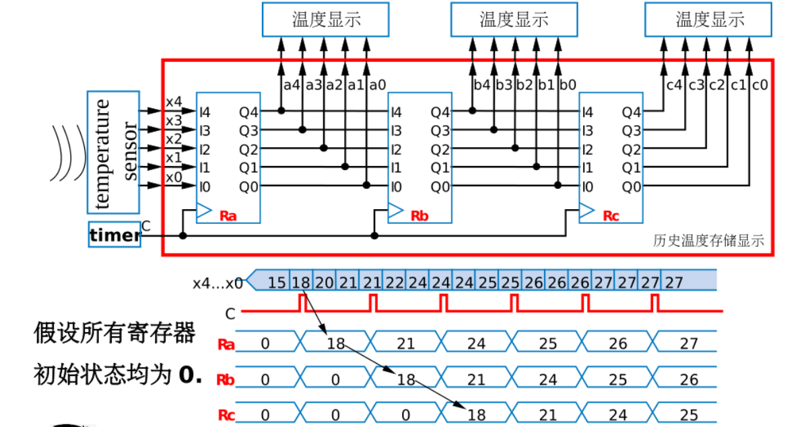

# 数电笔记
[toc]

## 数制和编码
**数制**
1. 二进制
2. 八进制
3. 十进制
4. 十六进制

**二进制与十进制的转换**
1. 二进制转十进制
将二进制的每位位权展开即可
1. 十进制转二进制
整数部分除2取余直至为0
小数部分乘2取整数直至达到精度

**编码**
1. BCD码
   1. 8421码
   2. 余3码
2. 格雷码（相邻两状态只有一位发生变化）
3. 奇偶校验码（解决传输过程中是否有1位发生变化）
## 逻辑代数基础
### 逻辑代数的三种基本运算
1. **与运算**（都为真才为真）
   
   与门
   
2. **或运算**
   
   或门
   
3. **非运算**
   
   非门
   

### 逻辑代数的基本定律和规则
#### 基本定律
1. 0-1律：
    1. $A\cdot0=0$
    2. $A+1=1$
2. 自等律:
   1. $A\cdot1=A$
   2. $A+0=A$
3. 重叠律:
   1. $A\cdot A=A$
   2. $A+A =A$
4. 互补律:
   1. $A\cdot \overline{A} = 0$
   2. $A+\overline{A}=1$
5. 交换律
6. 结合律
7. 分配率
   1.$ A+B\cdot C = (A+B)\cdot(A+C)$
8. 反演律
   1. $ \overline{A\cdot B}=\overline{A} + \overline{B} $
   2. $ \overline{A+B}=\overline{A} \cdot \overline{B} $ 
9. 还原律
    1.$ \overline{\overline{A}}=A $
#### 三个重要规则
1. **代入规则**
> 任何一个逻辑==等式==
> 1. **将等式两边出现的同一变量都代之以同一逻辑函数**
> 2. **等式任然成立**
2. **反演规则**
>对于任意一个==逻辑函数式==**$F$**
> **1. 将表达式中的所有"$\cdot$"换成"$+$","$+$"换成"$\cdot$"**
> **2. 将常量“1”换成“0”，“0”换成“1”**
> **3. 原变量变反变量，反变量变原变量**
> **所得到的结果就是反函数 $\overline{F}  $**

**注意**：不能改变原来的运算顺序，按先与后或的原则运算
3. **对偶规则**
> 对于任意一个==逻辑函数式==**$F$**
> **1. 将表达式中的所有"$\cdot$"换成"$+$","$+$"换成"$\cdot$"**
>  **2. 将常量“1”换成“0”，“0”换成“1”**
> **3. 而变量保持不变**
> **所得到的函数就是 $F $ 的对偶式 $F^* $**
> **若原等式成立 $F=G $ 则等式两边分别取对偶，等式任然成立 $F^*=G^* $**

#### 若干常用公式
1. 合并律
$$
    AB+A\overline{B} = A
$$
> 在逻辑代数中，如果两个乘积项分别包含了互补的两个因子，而其他因子都相同，那么这两个项被称为==相邻项==

2. 吸收律

吸收包含项
$$
    A+AB = A
$$
$$
证明：A+AB=A\cdot(1+B)=A\cdot 1=A
$$
> 说明在一个“与或表达式”中，如果某一乘积项的部分因子恰好等于另一乘积项的全部，则该乘积项是多余的

吸收冗余项
$$
    AB+\overline{A}C+BC=AB+\overline{A}C
$$
$$
证明：AB+\overline{A}C+BC = AB+\overline{A}C+(A+\overline{A})BC\newline =AB + ABC + \overline{A}C + \overline{A}BC \newline =AB + \overline{A}C
$$
> 在一个与或表达式中，如果两个乘积项的部分因子互补（AB项和A^B项中的互补因子），而其他因子（如B和C）**都是第三个乘积项中的因子**，则这个第三项是多余的

推论:
$$
    AB+\overline{A}C+BCD = AB+\overline{A}C
$$
### 复合逻辑与复合门
1. 
### 逻辑函数的两种标准形式
#### 最小项标准式
1. 标准最小项
> n个变量的最大项是n个变量的“与项”，其中每一个变量都以原变量或反变量的形式出现一次

2. n变量的标准最小项有n个相邻项，且相邻项具有性质：
$$
   A\overline{B} + AB = A
$$
3. 最小项标准式
> 即最小项标准式的或
==注意==：**任何一个逻辑函数都可以表示为最小项之和的形式**
#### 最大项标准式
1. 标准最大项
> n个变量的最大项是n个变量的“或项”，其中每一个变量都以原变量或反变量的形式出现一次

2. n个变量的标准最大项有n个相邻项，且相邻项具有性质
$$
   (A+\overline{B})(A+B)=A \newline
   这是最小项相邻项性质的对偶等式
$$
1. 最大项标准式
> 即最大项标准式的与
#### 最小项与最大项之间的关系：
> 变量数相同，编号相同的最小项和最大项之间存在互补关系,**即互为反函数关系**

例如对于 $ M_0=A+B+C $ 以及 $ m_0=\overline{A} \cdot \overline{B}\cdot \overline{C} $ 有：
$$
   \overline{A+B+C} = \overline{A} \cdot \overline{B}\cdot \overline{C} \newline
   即：\overline{M_0} = m_0
$$

### 逻辑函数的代数化简法
#### 化简的原则：
- 与项（或项）数最少
- 与项（或项）中的变量数最少
#### 化简的方法：
> 即通过逻辑代数的基本定律和公式对逻辑函数进行化简（较为复杂）
### 逻辑函数的卡诺图化简
#### 卡诺图化简的原理
> 卡诺图化简利用标准项的相邻项的性质进行化简
> $$
A\overline{B} + AB = A \newline
(A+\overline{B})(A+B)=A
> $$
> 标准项的相邻项相与（相或）可以消去互补项，保留相同项
### 非完全描述逻辑函数的化简
## 基于触发器的时序电路设计

**确定了输入变量，输出变量，以及状态个数得到触发器个数后，设计时序逻辑电路的本质就是设计组合逻辑电路**

### 试题演练

1. 有5个状态，因而应该使用三个D触发器，此时总共有8个状态，但我们只需要在主循环中存在5个有效状态，因而需要进行状态检查。
2. 根据状态图列出对应的次态真值表

可以看到还有3个状态没有对应的次态
我们只需填入使其能够自启动的次态即可
这样得到了就得到对应的激励真值表，由此可以写出激励方程。设计组合逻辑电路。
若有输入和输出的要求，再结合题目分析即可
### 几种典型时序逻辑电路介绍
#### 1.寄存器和移位寄存器
##### 1）寄存器
 > 寄存器用于寄存一组二进制代码，它被广泛用于各类数字系统和数字计算机中。

 ==**原理**==：利用D触发器，每当有触发信号打过来时，D触发器的输出端会等价于当前的D触发器值，同时**保持**到下一次触发信号的到来。这就实现了数据的寄存

==**实例**==：

通过控制时钟信号的周期，即可控制存储几个时间段的温度数据

##### 2）移位寄存器
正如上诉存储多个时间段的温度数据使用串行的寄存器。对于串行化的二进制数据，我们也可以串行D触发器进行存储，这就是移位触发器。
移位触发器按移位方向分为：
1. 单向移位寄存器：
   1. 左移寄存器
   2. 右移寄存器
   
   
2. 双向移位寄存器：
   
#### 2.计数器

##### 计数器的分类

### 原始状态图的建立
根据设计命题要求初步画出的状态图和状态表，称为原始状态图和原始状态表，它们也可能包含多余状态
#### 原始状态图的建立步骤

**通常结合径迹表来分析状态图**
例如“111”序列检测器的径迹表：
X 0 1 1 0 1 1 1 1 1 0 1 1 1 0
Z 0 0 0 0 0 0 1 1 1 0 0 0 1 0
### 基于触发器的同步时序逻辑电路的设计方法总结

### 状态化简
在建立原始状态图和原始状态表时，为了正确地反映设计要求，往往会多设置一些状态。
而状态的个数，会影响所需触发器的个数。
为了化简电路，我们需要化简状态（**即合并可以等价的状态**）
得到最简状态图和最简状态表
#### 状态等价的条件判断
1. 在相同输入条件下输出相同（**必要条件**）
2. 在相同的输入条件下次态等价
   1. 次态相同
   2. 次态就是现态
   3. 次态交错
   4. 次态互为隐含条件
**举例**

1. 在如图所示状态表中S2和S5在相同输入条件下，输出相同，次态相同，因而等价
2. 对于S6和S7，在相同的输入条件下，输出相同，次态交错，因而等价
3. 对于S1和S3，其等价还取决于S2和S4是否等价，因而是次态互为隐含条件
#### 状态等价的传递性
**传递性**：若Si和Sj等价，Si和Sk等价，则Sj和Sk也等价，记作[Sj Sk].
**等价类**：相互等价的状态的集合。
**最大等价类**：不被其他等价类所包含的等价类。
#### 隐含表化简
##### 1）作隐含表
隐含表是一种两项比较的指教三角形表格。其纵坐标为缺头状态序列，横坐标为缺尾状态序列，相当于
原始状态序列构成的矩形表的下半部分。
表中每一个小格用于表示一个状态对的等价情况。

##### 2）顺序比较
每对状态逐一比较，有三种情况
- 肯定不等价，在小格中填X，即不满足等价条件一：相同输入情况下输出相同
- 肯定等价，在小格中填O，即在满足等价条件一的情况下，同时满足次态相同/次态就是现态/次态交错
- 是否等价取决于隐含条件，则填入隐含条件对，根据隐含条件对的等价关系进一步判断

##### 3）关联比较
对顺序比较中遗留的隐含条件对进行比较。

**注意**：在AE、BE状态对判断时，AE对等价的条件是BE对等价；BE对等价的条件是AE对等价，则应该AE、BE都等价
这种情况属于交错等价
##### 4）找出最大等价类
通过以上求得的全部等价状态对，得到最大等价类为
[ABE]、[CF]、[D]和[G]
##### 5）列出最简状态表
从每一个最大等价类中选出一个为代表，替换其他等价类，列出的状态表，即为最简状态表：

## 常用中规模集成计数器功能分析（以74161为例
